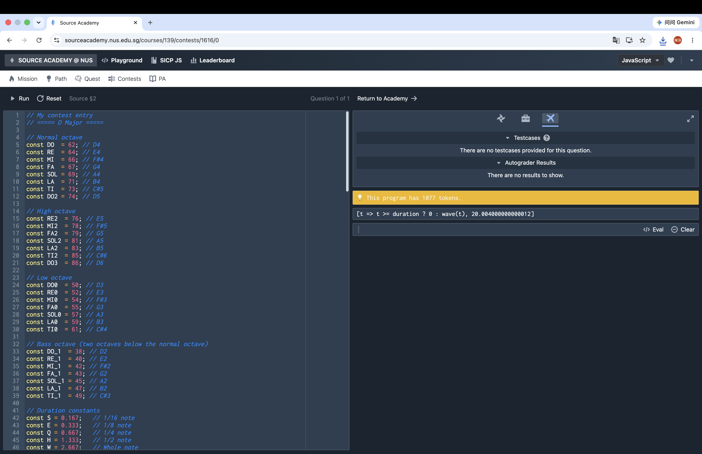

# Source Academy Music Contest

> **NUS School of Computing Summer Workshop (SWS) 2026**  
> **SICP Music Contest Submission**

This repository contains my submission for the **Source Academy Music Contest**, completed during the **NUS School of Computing Summer Workshop (SWS) 2026**.

The project is implemented in **JavaScript** using the **Source Academy Sound Library**. It features a two-part violin arrangement created through functional programming techniques and algorithmic music composition.

---

## Demo

A demonstration video of the composition is available in the `assets` folder.

> `assets/demo.mov`

---

## Preview



---

## Features

- 🎻 Two-part violin arrangement
- 🎼 D Major composition
- 🎵 Polyphonic playback using `simultaneously`
- 🎶 Sequential melody construction using `consecutively`
- 🎹 Musical timing with custom duration constants
- 💻 Implemented entirely in JavaScript

---

## Technologies

- JavaScript
- Source Academy (SICP JavaScript)
- Source Academy Sound Library
- Functional Programming

---

## Project Structure

```text
.
├── assets/
│   ├── demo.mov
│   └── screenshot.png
├── summer-music-snippet.js
├── README.md
└── LICENSE
```

---

## Running the Project

This project is designed to run in the **Source Academy** environment.

Since it relies on the built-in Sound Library, it cannot be executed directly using Node.js or a standard JavaScript runtime.

To run the project:

1. Open Source Academy.
2. Create a new program.
3. Copy the contents of `summer-music-snippet.js`.
4. Click **Run**.

---

## Project Background

This project was created as my submission for the **Game of Tones** music contest held during the **NUS School of Computing Summer Workshop (SWS) 2026**.

The goal was to compose and perform music programmatically using the Source Academy Sound Library while applying concepts from **Structure and Interpretation of Computer Programs (SICP)**.

---

## Learning Outcomes

Through this project, I gained experience with:

- Functional programming in JavaScript
- Higher-order abstractions
- Algorithmic music composition
- Musical sequencing and synchronization
- Program organization and modular design

---

## License

This project is released under the MIT License.
